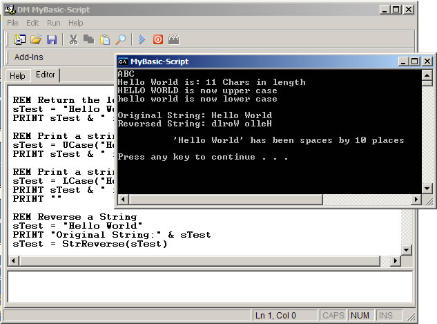



## DM My Basic Scripting Language V1\.1

### Description

Hello all this is the seconed part of my DM My Basic Scripting Language. Ok I now added some more keywords, Color, Goto,Clear added built in functions for string and math. added const support, Viald name checks for consts and variables, 3 more data types added., New sample scripts, Merge tool to convert scripts to exe and also some IDE updates.

Please note that this is still not a full project. at the moment. well hope you like it. please vote. Next update in 2 or 3 days.
 
### More Info
 

             |
---                |---
**Submitted On**   |2005-05-10 15:18:12
**By**             |[dreamvb](https://github.com/Planet-Source-Code/PSCIndex/blob/master/ByAuthor/dreamvb.md)
**Level**          |Intermediate
**User Rating**    |5.0 (25 globes from 5 users)
**Compatibility**  |VB 6\.0
**Category**       |[Coding Standards](https://github.com/Planet-Source-Code/PSCIndex/blob/master/ByCategory/coding-standards__1-43.md)
**World**          |[Visual Basic](https://github.com/Planet-Source-Code/PSCIndex/blob/master/ByWorld/visual-basic.md)
**Archive File**   |[DM\_My\_Basi1886705102005\.zip](https://github.com/Planet-Source-Code/dreamvb-dm-my-basic-scripting-language-v1-1__1-60464/archive/master.zip)

